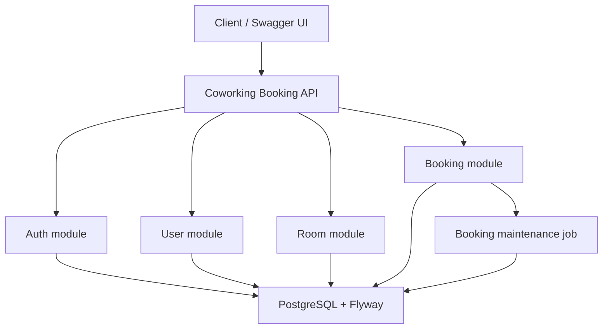

# Coworking Booking Platform • API

[](https://github.com/yusufjon-akhmedov/booking-coworking-platform/actions/workflows/CI.yml)

[](https://github.com/yusufjon-akhmedov/booking-coworking-platform/actions/workflows/DEPLOY.yml)

> JWT authentication, refresh/logout flow, RBAC, room management, booking lifecycle, availability search, scheduled completion

**Coworking Booking Platform API** is a monolithic REST backend for managing coworking rooms and reservations with JWT bearer tokens, role-based access control, PostgreSQL persistence via Flyway migrations, and Swagger UI for interactive API testing. It handles user registration and login, refresh-token rotation and logout, current-user profile access, admin customer management, room CRUD-style administration, room availability search, booking create/detail/cancel/reschedule/history flows, and automatic completion of past confirmed bookings.

It is an all-in-one backend service that covers:

- authentication and user access management
- room management and availability search
- booking creation, ownership rules, and lifecycle tracking

---

## Project overview - Coworking Booking Platform

**Coworking Booking Platform** models a coworking reservation backend where authenticated users can book available rooms and administrators can manage rooms and customer accounts.

**Core workflow:**

* users register and login with JWT-based authentication
* newly registered users receive the `CUSTOMER` role by default
* authenticated users can refresh tokens, logout, and view their own profile
* `ADMIN` users manage rooms and can enable or disable customer accounts
* `CUSTOMER` users create bookings, view their own bookings, and manage only their own bookings
* public users can search available rooms by time range
* confirmed bookings are marked `COMPLETED` automatically after their end time

**Main modules:**

* **auth**: registration, login, refresh/logout, JWT issuance, request authentication
* **user**: current profile, customer listing, enable/disable operations
* **room**: room creation, update, activation, deactivation, detail, list, and availability search
* **booking**: booking create/detail/history/cancel/reschedule flows and ownership rules
* **common**: OpenAPI config, global exception handling, paged responses, shared API wrapper

---

## Architecture diagram

High-level monolithic architecture overview for the coworking booking platform:



---

## Service scope - Coworking Booking Platform API

* **Authentication** with `register`, `login`, `refresh`, and `logout` endpoints returning JWT bearer tokens and refresh tokens.
* **Authorization** with `ADMIN` and `CUSTOMER` roles.
* **Current user profile** for authenticated users through `/api/users/me`.
* **Admin customer management** with paginated customer listing plus enable/disable operations.
* **Room management** where `ADMIN` users can create, update, activate, and deactivate rooms.
* **Room discovery** where authenticated users can list and inspect rooms, and public users can query availability by time range.
* **Booking management** with create, detail lookup, paginated history, cancel, and reschedule flows.
* **Ownership rules** where `CUSTOMER` users can access only their own booking records, while `ADMIN` users can view broader booking data.
* **Booking lifecycle** using `PENDING`, `CONFIRMED`, `CANCELLED`, and `COMPLETED` statuses, with scheduled completion for eligible past bookings.
* **Validation and error handling** using Jakarta Validation and centralized exception responses.
* **Swagger / OpenAPI** documentation for local and Docker-based testing.
* **Flyway migrations** executed automatically at startup.

---

## Tech stack & versions

* **Java** 21
* **Spring Boot** 3.5.13
* **Spring Web**
* **Spring Security**
* **Spring Data JPA**
* **Spring Validation**
* **Spring Mail**
* **Spring Actuator**
* **PostgreSQL**
* **Flyway**
* **Lombok**
* **JJWT** 0.13.0
* **Springdoc OpenAPI** 2.8.6
* **JUnit 5**
* **Mockito**
* **Testcontainers (PostgreSQL)**
* **Docker** + **Docker Compose**
* **Maven**

All versions are aligned with this service's `pom.xml`.

---

## API documentation

* **Swagger UI**: `http://localhost:8082/swagger-ui/index.html`
* **OpenAPI JSON**: `http://localhost:8082/v3/api-docs`
* **OpenAPI YAML**: `http://localhost:8082/v3/api-docs.yaml`

> Public by security config: `/api/auth/**`, `/actuator/**`, `/swagger-ui/**`, `/swagger-ui.html`, `/v3/api-docs/**`, and `/v3/api-docs.yaml`

---

## Main routes

| Path | Methods | Access | Notes |
|-------------------------------|----------------------------|-------------------------------------------|----------------------------------------------------------------|
| `/api/auth/register` | `POST` | **Public** | Register a user with default role `CUSTOMER` |
| `/api/auth/login` | `POST` | **Public** | Returns JWT access and refresh tokens |
| `/api/auth/refresh` | `POST` | **Public** | Rotates refresh token and returns a new token pair |
| `/api/auth/logout` | `POST` | **Authenticated** | Revokes the supplied refresh token |
| `/api/users/me` | `GET` | **Authenticated** | Returns current user profile |
| `/api/users/customers` | `GET` | `ADMIN` | Paginated customer list |
| `/api/users/{id}/disable` | `PATCH` | `ADMIN` | Disables a customer and revokes refresh tokens |
| `/api/users/{id}/enable` | `PATCH` | `ADMIN` | Re-enables a customer |
| `/api/rooms/available` | `GET` | **Public** | Searches active rooms available for the requested time range |
| `/api/rooms` | `GET`, `POST` | `GET` authenticated, `POST` `ADMIN` | Supports `page`, `size`, `sort`, `active`, `minCapacity`, `maxHourlyPrice`, and `name` |
| `/api/rooms/{id}` | `GET`, `PUT` | `GET` authenticated, `PUT` `ADMIN` | Room detail and room update |
| `/api/rooms/{id}/deactivate` | `PATCH` | `ADMIN` | Marks a room inactive |
| `/api/rooms/{id}/activate` | `PATCH` | `ADMIN` | Marks a room active |
| `/api/bookings` | `POST` | `CUSTOMER` | Creates a booking for the authenticated user |
| `/api/bookings/me` | `GET` | `CUSTOMER` | Returns the current customer's bookings |
| `/api/bookings/history` | `GET` | `CUSTOMER` | Supports `page`, `size`, `sort`, `status`, `roomId`, `from`, and `to` |
| `/api/bookings/admin` | `GET` | `ADMIN` | Paginated booking list with admin-level filtering |
| `/api/bookings/{id}` | `GET` | **Authenticated with role/ownership rules** | `CUSTOMER` users can access only their own booking |
| `/api/bookings/{id}/cancel` | `PATCH` | **Authenticated with ownership rules** | Customers can cancel only their own future booking |
| `/api/bookings/{id}/reschedule` | `PATCH` | **Authenticated with ownership rules** | Conflict-aware reschedule for the current customer's booking |

---

## Build & run

### A) Local JVM (no container for the app)

Prereqs: Java 21, Docker or PostgreSQL, and a database named `coworking_booking`

```bash
# start only PostgreSQL from docker compose
docker compose up -d db

# start the API against the dockerized database
DB_URL=jdbc:postgresql://localhost:15436/coworking_booking DB_PASSWORD=postgres ./mvnw spring-boot:run
```

If you prefer a local PostgreSQL instance instead of Docker, the current defaults are:

* database: `coworking_booking`
* username: `postgres`
* password: `1234`
* host port: `5436`

You can also update [`src/main/resources/application.yaml`](src/main/resources/application.yaml) as needed.

### B) Local Docker

This repo includes [Dockerfile](Dockerfile) and [docker-compose.yml](docker-compose.yml).

```bash
cp .env.example .env
docker compose up --build
```

After startup:

* API base URL: `http://localhost:8082`
* Swagger UI: `http://localhost:8082/swagger-ui/index.html`
* OpenAPI JSON: `http://localhost:8082/v3/api-docs`

> Flyway runs automatically on startup using scripts in `src/main/resources/db/migration`.
> Local JVM defaults use app port `8082`, local PostgreSQL port `5436`, database `coworking_booking`, username `postgres`, and password `1234`.
> Docker Compose exposes PostgreSQL on host port `15436`.
> Inside Docker Compose, the app connects to PostgreSQL with `jdbc:postgresql://db:5432/coworking_booking`.

---

## Testing

* **JUnit 5** is used for both unit and integration tests.
* **Mockito** is used in unit tests to mock repositories, authentication collaborators, JWT services, and scheduler-facing collaborators where needed.
* Unit tests focus on the service layer: `AuthService`, `BookingService`, `BookingMaintenanceService`, `RoomService`, and `UserService`.
* Controller slice tests cover authentication, booking, room, and user endpoints with Spring Security rules.
* Integration tests use **Spring Boot Test**, **MockMvc**, and **Testcontainers with PostgreSQL** for a production-like database setup.
* Integration coverage includes authentication, protected API access, admin/customer role behavior, booking flow, room flow, ownership rules, and automatic booking completion behavior.

Run the test suite with:

```bash
./mvnw test
```

Run only the integration tests with:

```bash
./mvnw -q -Dtest='*IntegrationTest,CoworkingBookingApplicationTests' test
```

---

## Ports (defaults)

* Coworking Booking API: **8082**
* Local PostgreSQL host port: **5436**
* Docker PostgreSQL host port: **15436**
* PostgreSQL container port: **5432**
